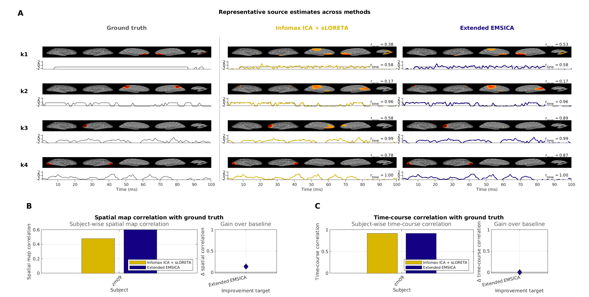
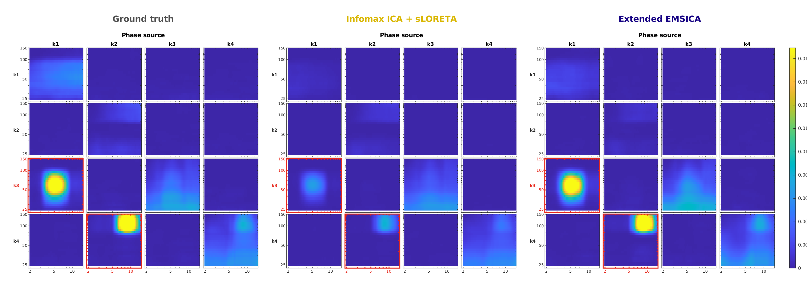

# Extended EMSICA-PAC demonstration

This repository preserves the EEGLAB-based `zm09` manuscript workflow while
keeping packaged inputs separate from generated runs.

<p align="center">
  
</p>

<p align="center">
  
</p>

## Requirements

- MATLAB R2024b
- EEGLAB 2020 or newer
- Signal Processing Toolbox
- Statistics and Machine Learning Toolbox

Add EEGLAB to the path or set `EEGLAB_ROOT` before setup.

## Rerun Extended EMSICA

```matlab
setup_emsica_pac;
demo_run_emsica(200, 'demo');
demo_generate_figures;
```

Training starts from the packaged Infomax B0 initializer. After
`demo_run_emsica` finishes, the Extended EMSICA results are available in the
`outputs/` folder. For the command above, generated EEGLAB datasets and PAC
caches are written to
`outputs/zm09/6emsica/ICs-synth-infomax-extended-demo-full/`, never into
`demodata/`.

## Data layout

```text
demodata/zm09/
├── 2epochs/EPs-synth/                         ground truth
├── 3ica/ICs-synth-infomax/                    Infomax baseline
├── 5lfm/source_plot_geometry.mat              reduced plotting meshes
└── 6emsica/B0-synth-infomax/                  cached initializer
```

Redundant `idx.txt`, `EEG_topo67x67.mat`, `zm09-all.*`, B0 `B.mat`, and
forward-model caches are intentionally omitted. The compact plotting geometry
contains only the reduced surfaces needed to render source maps from `B.mat`.

Main entry points are `demo_run_emsica.m`, `demo_generate_figures.m`,
`gradientemsica_cpu_tidy.m`, and `tests/verify_demo.m`.
